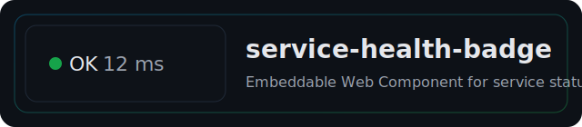

<div align="center">

  

  <br/>
  <br/>

<a href="https://www.npmjs.com/package/@worldhacker/service-health-badge"></a>
<a href="https://github.com/W0rldHacker/service-health-badge/actions/workflows/ci.yml"></a>


  <br/>

<a href="#quick-start"></a>
<a href="docs/en/index.md"></a>
<a href="./demo/index.html"></a>

</div>

<br/>

English | Русский: see docs [EN](docs/en/index.md) • [RU](docs/ru/index.md)

Minimal, framework‑free Web Component for displaying service status via `GET /health`. Lightweight, accessible, themeable, and i18n‑friendly.

- Zero deps, ESM, tree‑shakable
- Three UI variants: `dot` • `chip` • `badge`
- Emits `health-change` and `health-error`
- Debounced visual updates, background optimizations
- A11y‑ready: `role=status`, `aria-live=polite`, forced‑colors support

## Table of Contents

- [Table of Contents](#table-of-contents)
- [Quick Start](#quick-start)
- [Install](#install)
- [Usage](#usage)
- [Attributes and Properties](#attributes-and-properties)
- [Events](#events)
- [Theming](#theming)
- [React Integration](#react-integration)
- [Backend and CORS](#backend-and-cors)
- [Local Demo](#local-demo)
- [Browser Support](#browser-support)
- [License](#license)

## Quick Start

Docs: [EN](docs/en/getting-started.md) • [RU](docs/ru/getting-started.md)

Add the script and the element with your `endpoint`:

```html
<script
  type="module"
  src="https://cdn.jsdelivr.net/npm/@worldhacker/service-health-badge/dist/service-health-badge.js"
></script>

<service-health-badge
  endpoint="https://api.example.com/health"
  variant="badge"
  degraded-threshold-ms="150"
></service-health-badge>
```

## Install

Docs: [EN](docs/en/getting-started.md#install) • [RU](docs/ru/getting-started.md#установка)

- npm: `npm i @worldhacker/service-health-badge`
- pnpm: `pnpm add @worldhacker/service-health-badge`
- yarn: `yarn add @worldhacker/service-health-badge`

Import in your app:

```js
import '@worldhacker/service-health-badge';
```

Via CDN (ESM):

```html
<script
  type="module"
  src="https://cdn.jsdelivr.net/npm/@worldhacker/service-health-badge/dist/service-health-badge.js"
></script>
```

## Usage

Docs: [EN](docs/en/usage.md) • [RU](docs/ru/usage.md)

Minimal example:

```html
<service-health-badge endpoint="/health"></service-health-badge>
```

Full example with params and i18n:

```html
<service-health-badge
  endpoint="/health"
  interval="10000"
  timeout="3000"
  variant="badge"
  degraded-threshold-ms="200"
  labels='{"ok":"OK","degraded":"Slow","down":"Down","unknown":"—","offline":"Offline"}'
></service-health-badge>
```

JS API (props/methods):

```js
const el = document.querySelector('service-health-badge');
el.interval = 8000;
el.timeout = 2500;
el.showLatency = true;
el.degradedThresholdMs = 150;
el.labels = { degraded: 'Reduced' };
await el.refresh();
```

## Attributes and Properties

Docs: [EN](docs/en/api.md) • [RU](docs/ru/api.md)

- `endpoint`: string — `GET /health` endpoint (required to poll).
- `interval`: number (ms), default `10000` — polling period.
- `timeout`: number (ms), default `3000` — request timeout.
- `labels`: JSON, merged with defaults — localized labels.
- `variant`: `dot` | `chip` | `badge` (default `badge`).
- `show-latency`: set `false` to hide latency in `badge`.
- `degraded-threshold-ms`: number (ms). If base is `ok` and latency > threshold → render `degraded`.
- `focusable`: when present, element is keyboard focusable.
- `dev-state`: force a state for local dev (`unknown|ok|degraded|down|offline`).

Available statuses: `unknown`, `ok`, `degraded`, `down`, `offline`.

Methods:

- `refresh(): Promise<boolean>` — poll immediately.
- `setState(status, latencyMs?)` — set state manually (threshold still applies).

## Events

Docs: [EN](docs/en/api-events-and-i18n.md) • [RU](docs/ru/api-events-and-i18n.md)

- `health-change` — on effective status change. `detail: { status, latencyMs, at }`.
- `health-error` — on network/timeout/JSON error. `detail: { error }`.

Example:

```html
<service-health-badge id="hb" endpoint="/health"></service-health-badge>
<script>
  const el = document.getElementById('hb');
  el.addEventListener('health-change', (e) => {
    const { status, latencyMs } = e.detail;
    console.log('status =', status, 'latency =', latencyMs);
  });
  el.addEventListener('health-error', (e) => console.warn('health-error:', e.detail.error));
  // document.getElementById('btn').onclick = () => el.refresh();
</script>
```

## Theming

Docs: [EN](docs/en/theming.md) • [RU](docs/ru/theming.md) • Variants [EN](docs/en/variants.md) • [RU](docs/ru/variants.md)

CSS custom properties are supported (global or per element):

- `--health-size`: base font size (`0.875rem`)
- `--health-radius`: border radius (`0.5rem`)
- `--health-color-fg`: text color (`currentColor`)
- `--health-chip-bg`: chip/badge background (`rgba(0,0,0,0.05)`)
- `--health-bg-ok|degraded|down|unknown|offline`: indicator colors
- `--health-focus-ring`: focus ring color (optional)

## React Integration

Docs: [EN](docs/en/integrations/react.md) • [RU](docs/ru/integrations/react.md)

Use the wrapper from `examples/react/HealthBadge.tsx` or create the element directly:

```tsx
import React from 'react';
import '@worldhacker/service-health-badge';

export function HealthBadge(props: any) {
  return React.createElement('service-health-badge', props as any);
}

<HealthBadge endpoint="/health" variant="badge" degradedThresholdMs={150} />;
```

## Backend and CORS

Docs: [EN](docs/en/backend-cors-checklist.md) • [RU](docs/ru/backend-cors-checklist.md)

Component expects JSON from `GET /health`. Minimal:

```json
{ "status": "ok", "timings": { "total_ms": 23 } }
```

## Local Demo

- Start mock `/health` server: `npm run mock` → prints `http://127.0.0.1:<port>`
- Preview static demo: `npm run preview` → open `/demo/index.html`

The demo UI lets you switch server vs. local fetch stub.

## Browser Support

- Modern browsers with Web Components (Custom Elements, Shadow DOM).
- Polyfills are not bundled. Add CE/Shadow DOM polyfills if you target very old browsers.

## License

MIT © 2024 — see `LICENSE`.
